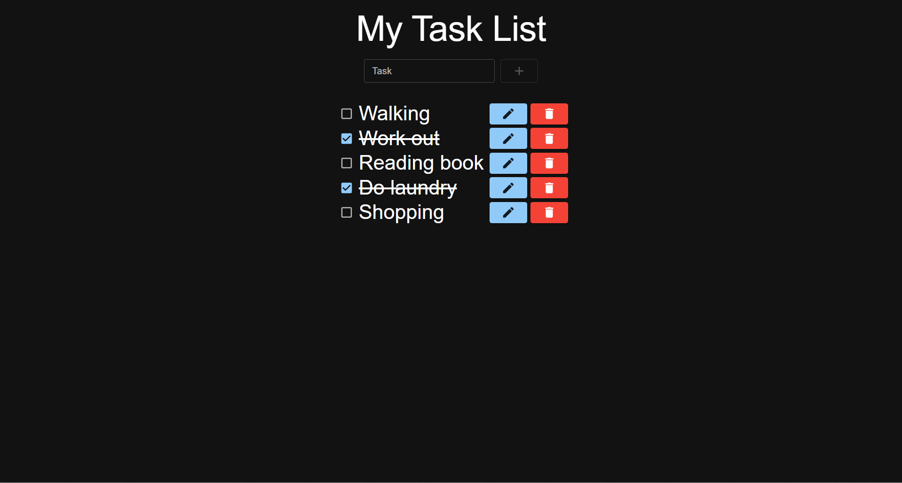

# Task List



# Full Stack React Crud App Tutorial

## Instructions to start project

1. Open your terminal and cd into the "ui" directory: `cd ui` then run `npm install` after that finishes installing you can now run `npm start` and your react app will start running on http://localhost:3000/
2. Open a new terminal (with the react app still running) and cd into the "api" directory: `cd api` then run `npm install` after that is finished installing you can now run `npm run dev` which will run your api on http://localhost:3001/
3. Assuming you have your DynamoDB set up properly and updated the API_URL variable in the utils file with your deployed
API url, you should be able to use the application now! Enjoy!

## Technologies

DynamoDB | Lambda | Amplify | Express | React | Node

## Helpful Docs

### Material UI

#### Installation

https://mui.com/material-ui/getting-started/installation/

#### Icons

https://mui.com/material-ui/material-icons/

### Express:

#### Getting Started

https://expressjs.com/en/starter/hello-world.html

### DynamoDB CRUD functions:

#### Create

https://docs.aws.amazon.com/amazondynamodb/latest/developerguide/example_dynamodb_PutItem_section.html

#### Read

https://docs.aws.amazon.com/amazondynamodb/latest/developerguide/example_dynamodb_Scan_section.html

#### Update

https://docs.aws.amazon.com/amazondynamodb/latest/developerguide/example_dynamodb_UpdateItem_section.html

#### Delete

https://docs.aws.amazon.com/amazondynamodb/latest/developerguide/example_dynamodb_DeleteItem_section.html

## Instructions creating monorepo from scratch

### Creating React Application

1. Create a new directory (folder) in your project called ui
2. Open your terminal and cd into this new directory: `cd ui`
3. Now run the command: `npx create-react-app .`
4. Now run the command `rm -rf .git` while still in the `ui` directory we created. This will remove git associated with this directory. We want git to be used in the root directory of our project and not in the ui folder that's why we are doing this
5. You have successfully created your react application and can use the command `npm start` to start the app. To stop running the application `ctrl + c`

### Creating API (Express Server)

1. Create a new directory (folder) in your project called api
2. Open your terminal and cd into this new directory: `cd api`
3. Run the command `npm init` this will ask you a handful of questions, just hit enter for each question. This will create our package.json for us
4. Now we can install our dependencies `npm i express nodemon`
5. Create a file in our api directory called `index.js` and add the following express code:

```
const express = require("express");
const app = express();
const port = 3001;

app.get("/", (req, res) => {
  res.send("Hello from express!");
});

app.listen(port, () => {
  console.log(`Example app listening at http://localhost:${port}`);
});
```

5. We want to add some scripts to our package.json so add the following:

```
  "scripts": {
    "start": "node index.js",
    "dev": "nodemon index.js"
  },
```

6. We can start our API. While in the api directory run `npm start` and you can now go to `http://localhost:3001/` to see the "Hello from express!" message.

### Pushing code to github

1. Now is a good time to push your code to github. In the root directory of the project run: `git init` this will make the folder a git repository allowing us to run git commands in it.
2. Now we can run the following commands to push our code to github like normal:

```
git add .
git commit -m "feat: created ui and api"
git branch -M main
git remote add origin github-repo-url-goes-here
git push -u origin main
```
